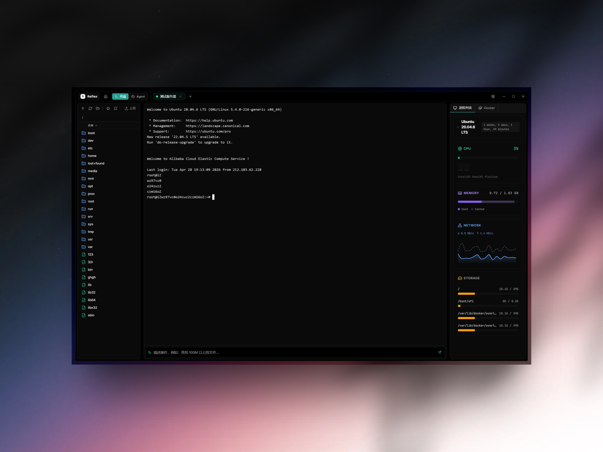
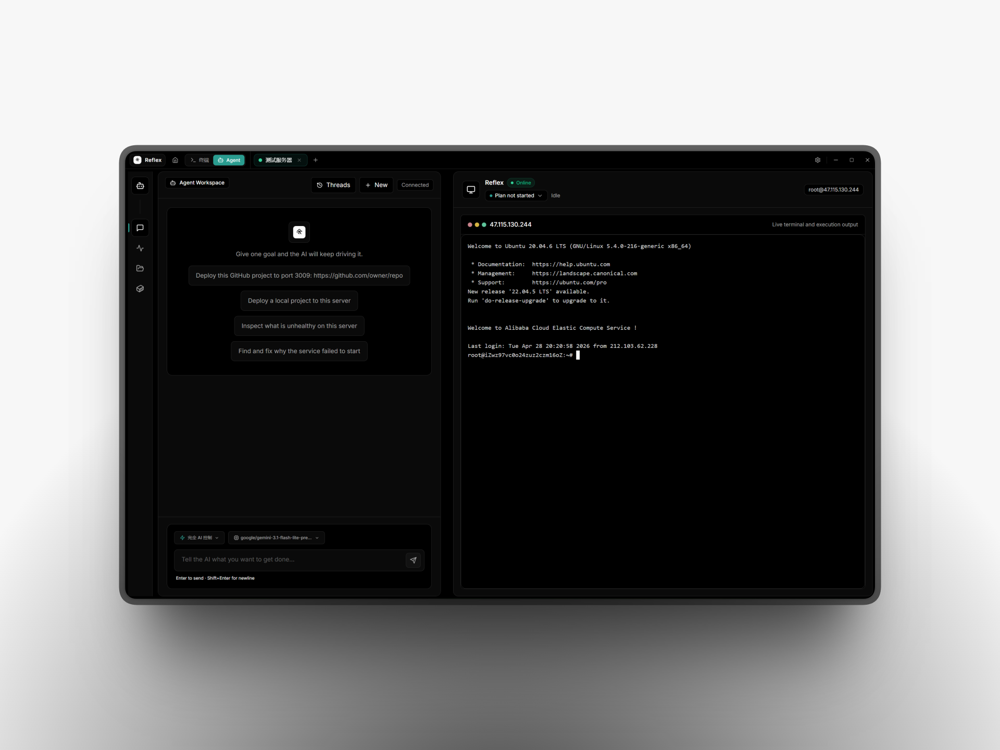

<div align="center">
  <a href="https://github.com/Sunhaiy/Reflex">
    
  </a>

  <h1>Reflex</h1>

  <b>A modern SSH operations workbench with an agent-native workflow.</b>

  <p>
    Multi-session terminal, SFTP, Docker, monitoring, deployment automation, and AI-assisted server work in one desktop app.
  </p>

  <p>
    <a href="./README.md">English</a>
    |
    <a href="./README.zh-CN.md">Chinese</a>
    |
    <a href="./README.ja.md">Japanese</a>
    |
    <a href="./README.ko.md">Korean</a>
  </p>

  <p>
    <a href="https://github.com/Sunhaiy/Reflex/actions/workflows/build-release.yml">
      
    </a>
    <a href="./LICENSE">
      
    </a>
    
    
    
    
  </p>

  <p>
    <sub>
      Built for developers who want remote servers to feel local, observable, and repairable.
    </sub>
  </p>
</div>

---

<div align="center">
  <a href="https://github.com/Sunhaiy/Reflex">
    <picture>
      <source media="(prefers-color-scheme: dark)" srcset="./9cb6011b-c5a7-47ff-8544-9d40f0baf3b5.png" />
      <source media="(prefers-color-scheme: light)" srcset="./b1405725-c357-41d1-ac57-43db4634bc16.png" />
      
    </picture>
  </a>
</div>

## Overview

**Reflex** is a cross-platform SSH desktop client designed around real server work: connecting, inspecting, editing, deploying, recovering, and continuing tasks without losing context.

It combines a polished terminal workspace with practical infrastructure tools and an Agent mode that can plan server-side tasks, run commands, inspect output, retry on transient failures, and keep the execution trail visible.

## Why Reflex

- **One workspace for remote work:** terminal, files, Docker, monitoring, and AI actions stay side by side.
- **Agent-native execution:** ask for an outcome, then watch the plan, commands, progress notes, and verification steps unfold.
- **Local-first configuration:** connection profiles, AI settings, themes, and session history are stored locally.
- **Resumable sessions:** agent conversations and task state can be restored after switching servers or reopening the app.
- **Desktop packaging:** builds for Windows, macOS, and Linux through Electron Builder and GitHub Actions.

## Features

### Terminal And SSH

- Multi-session SSH tabs with persistent terminal state
- Password and private-key authentication
- Reconnect-aware command execution
- Inline AI command generation and selected-output actions
- Themeable terminal rendering with multiple presets

### Agent Workspace

- Natural-language task execution for server operations
- Long-running task plan, progress, and retry state
- Visible execution cards for local commands, remote commands, uploads, file writes, and tool results
- Deployment-oriented workflows for local folders and GitHub projects
- Session history for continuing previous work

### Files And Deployment

- SFTP file browser and remote file editing
- Upload, download, rename, delete, and directory creation
- Project packaging for deployment flows
- Remote Nginx/static deployment support
- GitHub project source resolution and server-side preparation

### Server Management

- Real-time CPU, memory, disk, and network monitoring
- Process list and kill action
- Docker container, image, log, and cleanup controls
- Server profile search, copy, edit, delete, and quick connect

### Customization

- Light, dark, black, cyberpunk, and custom-accent themes
- Configurable UI and terminal fonts
- Multiple AI provider profiles
- Multiple models per provider endpoint
- Localized interface options

## Screenshots

### Agent Workspace

<p align="center">
  
</p>

## Quick Start

```bash
git clone https://github.com/Sunhaiy/Reflex.git
cd Reflex
npm install
npm run dev
```

## Build

```bash
npm run build
npm run dist
```

Platform-specific packaging:

```bash
npm run dist:win
npm run dist:mac
npm run dist:linux
```

## Project Structure

```text
reflex
|- electron/            # Electron main process, IPC, SSH, deploy engine, agent runtime
|- src/                 # React renderer source
|  |- components/       # Terminal, Agent, Docker, files, monitor UI
|  |- pages/            # Settings and connection management
|  |- services/         # Frontend AI and app services
|  |- shared/           # Shared types, themes, locales, prompts
|  `- store/            # Zustand stores
`- .github/workflows/   # Build and release automation
```

## Tech Stack

- Electron
- React
- TypeScript
- Vite
- Tailwind CSS
- Zustand
- xterm.js
- ssh2
- Monaco Editor
- Recharts

## Contributing

Contributions are welcome. Please read [CONTRIBUTING](./CONTRIBUTING.md) and [CODE_OF_CONDUCT](./CODE_OF_CONDUCT.md) before opening an issue or pull request.

## Security

If you find a security issue, please follow the process in [SECURITY](./SECURITY.md).

## License

See [LICENSE](./LICENSE).
